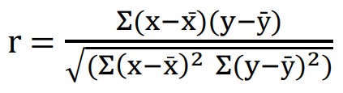
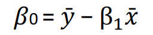
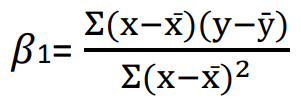
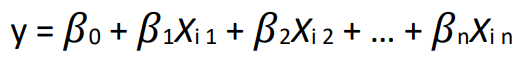
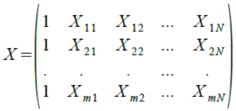
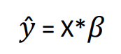
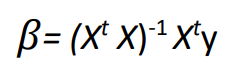
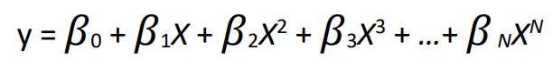

# Inteligência Artificial - Trabalho 03

Fundação da Universidade Regional de Blumenau

Alunos: 
* [Bruno Geisler Vigentas](https://github.com/bvigentas)
* [Francisco Lucas Sens](https://github.com/franciscosens)
* [Gustavo Westarb](https://github.com/GustavoWestarb)
* [William Lopes da Silva](wiiulopes)

[Conteúdo](assets/Conteúdo/Uni04_AprendizadoSupervisionadoRegressão.pdf)

* [Fase 1: Análise de Correlação e Regressão Linear](#Fase-1:-Análise-de-Correlação-e-Regressão-Linear)
* [Fase 2: Análise de Regressão Linear Múltipla](#Fase-2:-Análise-de-Regressão-Linear-Múltipla)
* [Fase 3: Regressão Polinomial - Overfitting](#Fase-3:-Regressão-Polinomial---Overfitting)

## Fase 1: Análise de Correlação e Regressão Linear

Este trabalho visa entender a natureza da relação linear entre os dados. Faremos a análise de correlação, que é utilizada para medir a intensidade de associação de duas variáveis (Relação Linear), e, também a análise de regressão, que é utilizada para prever valores de uma variável dados os valores de outra. A correlação foca primeiramente na associação das variáveis, enquanto a regressão é designada para ajudar a fazer previsões.

Considere os três grupos de dados (datasets) a seguir:

```
x1 = [10;8;13;9;11;14;6;4;12;7;5];
y1 = [8.04;6.95;7.58;8.81;8.33;9.96;7.24;4.26;10.84;4.82;5.68];
x2 = [10;8;13;9;11;14;6;4;12;7;5];
y2 = [9.14;8.14;8.47;8.77;9.26;8.10;6.13;3.10;9.13;7.26;4.74];
x3 = [8;8;8;8;8;8;8;8;8;8;19];
y3 = [6.58;5.76;7.71;8.84;8.47;7.04;5.25;5.56;7.91;6.89;12.50];
```

A melhor maneira para visualizar a relação entre os dados é gerando um Diagrama de Dispersão (utilize o comando scatter – veja também as bibliotecas numpy, matplotlib e math do python). O Diagrama de Dispersão representa o quanto uma variável é afetada por outra.

A correlação mede a direção e intensidade da relação linear. O coeficiente da correlação r entre as variáveis **x** e **y** são calculadas com a seguinte equação:



A reta da regressão é definida por:


Onde,





1) Implemente duas funções chamadas **correlacao** e **regressao**. Cada uma deve ter dois vetores Nx1 como entrada, onde N é a dimensão do vetor (no caso de x N=11). A primeira função deve calcular o coeficiente de correlação r, e a segunda função deve calcular a regressão, isto é, β**0** e β**1**.

2) Faça um script no Python chamado **demo** onde para cada dataset faça os seguintes comandos:

    a. Faça um Gráfico de Dispersão (veja função **scatter**).

    b. Calcule o coeficiente de correlação.

    c. Trace a linha da regressão no Gráfico de Dispersão (veja a função **plot**)

    d. Mostre os coeficientes de correlação e regressão no Gráfico de Dispersão (utilize a função **title**)

3) Qual dos datasets não é apropriado para regressão linear? 


## Fase 2: Análise de Regressão Linear Múltipla

Agora, em vez de uma variável independente x (por exemplo, quando nós modelamos o preço da casa com base apenas em seu tamanho), vamos considerar múltiplas variáveis independentes x1, x2, ... xN. Com isso, iremos prever preço da casa com base em seu tamanho e número de quartos.

Neste caso, a linha de regressão é:



Onde a Matriz X é definida como:



Deste modo, podemos definir a linha de regressão de uma forma mais simples:



A expressão para os parâmetros do modelo 𝛽 é:



Semelhante a fase anterior, você deve implementar a função **regmultipla** que calcula os parâmetros 𝛽 para os dados de entrada y e X. Faça um script chamado **rmdemo** que faz o seguinte:


a. Faça o download dos dados do arquivo **data.mat** ou **data.csv**. A primeira coluna é o tamanho da casa, a segunda coluna é o número de quartos, e a terceira coluna é o preço da casa.

b) Gere uma matriz X para as variáveis independentes (que são o tamanho da casa e o número de quartos) e o vetor y da variável dependente (que é o preço).

c) Verifique a correlação e a regressão para **Tamanho da casa** e **Preço**, e, **Número de quartos** e **Preço** e faça o gráfico de dispersão.

d) Faça o gráfico de dispersão em 3D com o tamanho da casa, número de quartos, e o preço da casa. Neste caso iremos trabalhar com o espaço 3D (verifique como usar **Axes3D**).

e) Trace a linha da regressão no Gráfico de Dispersão. Você pode girar este gráfico para visualizar melhor os dados.

f) Mostre na figura os coeficientes de correlação entre **Tamanho da casa** e **Preço** e **Número de quartos** e **Preço**.

g) Calcule o preço de uma casa que tem tamanho de 1650 e 3 quartos. O resultado deve ser igual a 293081.

## Fase 3: Regressão Polinomial - Overfitting

Nesta fase iremos considerar a Regressão Polinomial com uma variável x. A Regressão Polinomial encaixa uma relação não linear entre o valor de x e o valor correspondente de y. Neste caso a fórmula geral da Regressão Polinomial é:



a linha de regressão pode ser reescrita como:


Desta vez, para calcular o valor de **𝛽** use a função **polyfit**. Você deverá verificar o que acontece quando vamos aumentamos o grau de um polinômio, ou seja, quando consideramos N = 1, 2, 3 ...

Faça um script **demo_regressaop** que faz o seguinte:

a. Baixe o arquivo **data_preg.mat** ou **data_preg.svg**. A primeira coluna representa os valores de x e a segunda coluna representa os valores de y.

b) Faça o Gráfico de dispersão dos dados.

c) Use a função **polyfit** para gerar a linha de regressão para N = 1 e trace-o no gráfico de dispersão na cor vermelha (plot (x, y, 'r')). (observe que nesta função a numeração coeficiente é invertida! β0=βN , β1=βN−1 , β2=βN−2 , ...βN=β0)

d) Trace a linha de regressão para N = 2 no gráfico na cor verde.

e) Trace a linha de regressão para N = 3 no gráfico na cor preta.

f) Trace a linha de regressão para N = 8 no gráfico na cor amarela.

g) Calcule o Erro Quadrático Médio (EQM) para cada linha de regressão. Qual é o mais preciso?

h) Para evitar o overfitting, divida os dados aleatoriamente em Dados de Treinamento e Dados de Teste. Use os primeiros 10% dos dados como conjunto de teste, e o resto como de treinamento.

i) Repita os passos de **c - f**, mas agora use **apenas os dados de treinamento** para ajustar a linha de regressão.

j) Repita o passo **g**, mas agora utilize **somente os dados de Teste** para calcular o erro.

k) Que método é o mais preciso neste caso?

## Observações:

* Envie um total de 3 scripts: **demo**, **rmdemo**, **demo_regressaop** (todas com comentários do que foi feito), e responda as perguntas nos comentários de cada script.

* Dentro dos scripts deverá conter as 3 funções: **correlacao**, **regressao**, **regmultipla**.

* Coloque o nome dos integrantes do grupo na primeira linha das funções e scripts.

* Envie apenas uma versão para todo o grupo, especificando também os nomes de todos os outros colegas.
    * T3_Aluno1_Aluno2_Aluno3.zip

